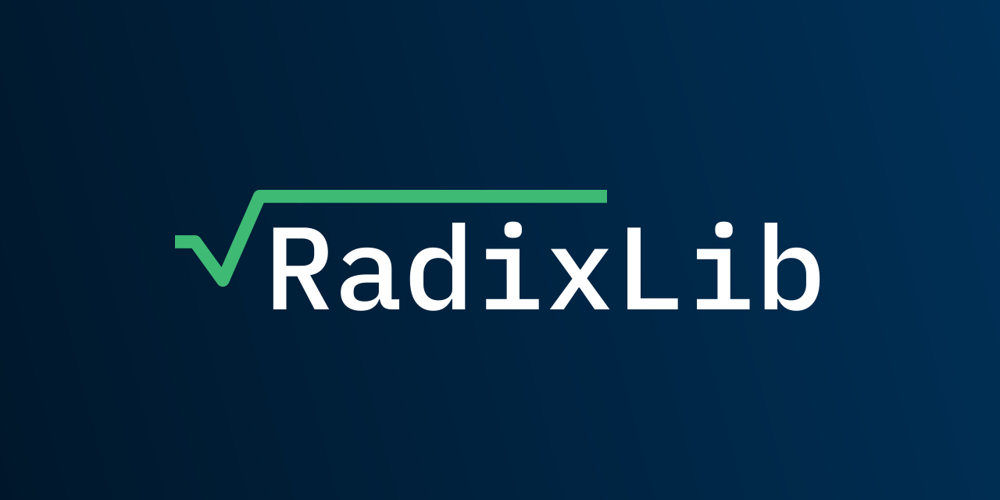

# RadixLib




[](https://pypi.org/project/radixlib/1.0.0/)
[](https://opensource.org/licenses/MIT)
[](https://www.python.org/downloads/release/python-370/)
[](https://www.python.org/downloads/release/python-380/)
[](https://www.python.org/downloads/release/python-390/)
[](https://www.python.org/downloads/release/python-3100/)

## Table of Content

  * [Introduction](#introduction)
  * [Installing the Package](#installing-the-package)
    + [Method 1: Setting up the package through pip and PyPI](#method-1-setting-up-the-package-through-pip-and-pypi)
    + [Method 2: Setting up the package from source](#method-2-setting-up-the-package-from-source)
  * [Getting Started](#getting-started)
    + [Loading Your Wallet](#loading-your-wallet)
      - [Method 1: Loading your wallet through the mnemonic phrase](#method-1-loading-your-wallet-through-the-mnemonic-phrase)
      - [Method 2: Loading your wallet through the seed](#method-2-loading-your-wallet-through-the-seed)
      - [Method 3: Loading your wallet through the `wallet.json`](#method-3-loading-your-wallet-through-the-walletjson-)
    + [Query for Account Balance](#query-for-account-balance)
    + [Query for Account Transactions](#query-for-account-transactions)
    + [Additional More Detailed Examples](#additional-more-detailed-examples)
  * [Acknowledgement](#acknowledgement)
  * [Licence: MIT](#licence-mit)

## Introduction

RadixLib is an API wrapper for the Radix Gateway API which allows for a quick, easy, and pythonic way to interact with the Radix blockchain directly from python. The following are some of the features offered in this python package:

* Connecting to the Radix blockchain through the Gateway API.
* Connecting to custom Radix networks (i.e. stokenet, localnet, devnets or any custom network.)
* Querying the Gateway API for information (example: account balances, transactions, etc...)
* Building, signing, and submitting transactions to the blockchain.
* Creating signers to hold the seed phrase and derive public and private keys.
* Loading signers from the mnemonic phrase, seed phrase or the `wallet.json` from the Radix desktop wallet.
* Creating signers from random mnemonic phrases.
* A powerful derivations module for all kinds of derivations needed in Radix.

The features listed above are only a small subset of the features offered by this python package. This wrapper is fully compatible with the Gateway API which means that all of the operations that can be done through the Gateway API are supported by this package. This package offerers so much more and can in theory be used to build a python version of the [Radix desktop wallet](https://github.com/radixdlt/olympia-wallet).

## Installing the Package

The radixlib package is available on [pypi](https://pypi.org/project/RadixLib/) which means that it can be installed through pip. Alternatively, the package may be installed and setup from the source code. The sections below outline how these two methods may be carried out.

### Method 1: Setting up the package through pip and PyPI
The installation of this package through pip is as simple as running the following command

```shell
python3 -m pip3 install radixlib
```

After running the above command, you should find that the radixlib package is now installed to the python interpreter that you're currently using.

### Method 2: Setting up the package from source

To setup this package from the source code you may begin by cloning this repository to your local machine and then running the setup script. You may do that through the following commands:

```shell
git clone -b master https://github.com/0xOmarA/RadixLib
cd RadixLib
python3 setup.py install
```

After installing the package through one of the methods outlined above, you can check if the package has been installed correctly or not by running `pip freeze` and checking if `radixlib` is listed there or not.

## Getting Started

In this section of the document, a series of simple examples are given to help you get started using this package. More detailed and indepth examples are provided in the [examples](https://github.com/0xOmarA/RadixLib/tree/master/examples) directory.

With the package installed, you are now ready to begin using this package and the functionality that it has. One thing to note is that the name that this package uses in python is the same as the name it uses on Github and on mypy; meaning, that if we were to import this package into our python script, we may do so using the following code:
```python
import radixlib
```

However, throughout this code and in the examples, the name of the package import is changed to `radix` upon import to make the package somewhat easier to use a little bit less verbose. So, you will often see this package imported in the following manner:
```python
import radixlib as radix
```

### Loading Your Wallet 

The very first example that we will be looking at here is how can you load your wallet using this packahe into your python code. There are three main methods which you may use to load your wallet:

* Through the mnemonic phrase
* Through the seed
* Through the `wallet.json` file obtained from the Radix desktop wallet

The following three examples go through how loading your wallet may be done through all three of the above-mentioned methods:

#### Method 1: Loading your wallet through the mnemonic phrase


```py
import radixlib as radix

def main() -> None:
    # The network that we will be connecting the wallet to
    network: radix.network.Network = radix.network.MAINNET

    # The mnemonic phrase we will be using to load the wallet
    mnemonic_phrase: str = "abandon abandon abandon abandon abandon abandon abandon abandon abandon abandon abandon abandon"

    # Loading the wallet from the mnemonic phrase
    wallet: radix.Wallet = radix.Wallet(
        provider = radix.Provider(network),
        signer = radix.Signer.from_mnemonic(mnemonic_phrase)
    )
    print("Wallet address:", wallet.address)

if __name__ == "__main__":
    main()
```

To load a wallet through the mnemonic phrase the first thing that we do is define the network that we will be connecting to (for the purpose of this example we connect to the radix mainnet) and then we define the mnemonic phrase that we will be using for the wallet. Finally, the `radix.Wallet` object is instantiated through the provider and the signer.

In this case, the `network` variable is used to inform the provider of the network and the url of the gateway API to communicate with, and the mnemonic phrase is used by the signer to derive the seed and eventually the public and private keys of the wallet. 

#### Method 2: Loading your wallet through the seed

```python
import radixlib as radix

def main() -> None:
    # The network that we will be connecting the wallet to
    network: radix.network.Network = radix.network.MAINNET

    # The seed phrase that the signer will be using for the wallet
    # Don't worry, this is the seed phrase of the abandon wallet so I'm not exposing any sensitive 
    # info ;)
    seed: str = "94cfb81f135f8d85d787a84173cf1e9fc51792f3723e2b93a162fa57a03370fd80971d026eed300544116dfee4d5b375c77ea86b65dfd44e2ecda58044684fe0"

    # Loading the wallet from the mnemonic phrase
    wallet: radix.Wallet = radix.Wallet(
        provider = radix.Provider(network),
        signer = radix.Signer(seed)
    )
    print("Wallet address:", wallet.address)

if __name__ == "__main__":
    main()
```

As you might notice, the code used for this second method is almost identical to that used in the first method. However, there are two main differences here:

* We're now using the seed to create our `Signer` object instead of using the mnemonic.
* We're instantiating the `Signer` through the class constructor and not through a class function.

Aside from the above-mentioned differences, the code for the previous method and this method is identical.

#### Method 3: Loading your wallet through the `wallet.json`

You might be wondering "what exactly is a `wallet.json` file?" and you would be right to ask that question. In short, `wallet.json` is a file that the Radix desktop wallet produces where your mnemonic phrase is encrypted using your wallet passphrase. You may find more information about the `wallet.json` file and it's format in [this](https://docs.radixpool.com/decoding-the-radix-wallet) amazing article written by Stuart from [RadixPool.com](https://www.RadixPool.com).

To load up a `Radix.Wallet` object from the `wallet.json` file, you may use the following code:

```py
import radixlib as radix

def main() -> None:
    # The network that we will be connecting the wallet to
    network: radix.network.Network = radix.network.MAINNET

    # The path to your wallet.json file and the passphrase used by the Radix desktop wallet
    wallet_json_path: str = "./wallet.json"
    passphrase: str = "MyUltraSuperSecurePassword1234"

    # Loading the wallet from the mnemonic phrase
    wallet: radix.Wallet = radix.Wallet(
        provider = radix.Provider(network),
        signer = radix.Signer.from_wallet_json(wallet_json_path, passphrase),
    )
    print("Wallet address:", wallet.address)

if __name__ == "__main__":
    main()
```

In this case, we are using the path to the `wallet.json` file as well as the passphrase which the Radix wallet uses to encrypt the contents of the file as arguments to the `radix.Signer.from_wallet_json` method to create the signer that we will be using for the wallet object.

### Query for Account Balance

Now that we have discussed how a `radix.Wallet` object may be instantiated, we may now begin to dive deeper into what the `radix.Wallet` object offers and what it gives us. One of the things that the `radix.Wallet` object allows for is an easy way to query the gateway API for the balance of the currently loaded account. 

To demonstrate querying for the account balance may be done, we will take the code from [Method 1: Loading your wallet through the mnemonic phrase](#method-1-loading-your-wallet-through-the-mnemonic-phrase) and extend it to allow for the added functionality. The modified code is as follows:
```python
from typing import Dict
import radixlib as radix

def main() -> None:
    # The network that we will be connecting the wallet to
    network: radix.network.Network = radix.network.MAINNET

    # The mnemonic phrase we will be using to load the wallet
    mnemonic_phrase: str = "abandon abandon abandon abandon abandon abandon abandon abandon abandon abandon abandon abandon"

    # Loading the wallet from the mnemonic phrase
    wallet: radix.Wallet = radix.Wallet(
        provider = radix.Provider(network),
        signer = radix.Signer.from_mnemonic(mnemonic_phrase)
    )
    print("Wallet address:", wallet.address)

    # Getting the balance for the currently loaded account
    balances: Dict[str, Dict[str, int]] = wallet.get_account_balances()
    print("Wallet balances:", balances)

if __name__ == "__main__":
    main()
```

The only section that was added in this code is a call to the `wallet.get_account_balances` method which gets the balances of all of the tokens that the account currently holds. 

### Query for Account Transactions

Another typical thing which you might want to do is to query for the transaction history for your account. This is very simple to do using the radixlib package. 

Extending upon the code from the previous example, we may get the last 30 transactions involving our account through the code below:
```python
from typing import Tuple, List, Dict, Any
import radixlib as radix

def main() -> None:
    # The network that we will be connecting the wallet to
    network: radix.network.Network = radix.network.MAINNET

    # The mnemonic phrase we will be using to load the wallet
    mnemonic_phrase: str = "abandon abandon abandon abandon abandon abandon abandon abandon abandon abandon abandon abandon"

    # Loading the wallet from the mnemonic phrase
    wallet: radix.Wallet = radix.Wallet(
        provider = radix.Provider(network),
        signer = radix.Signer.from_mnemonic(mnemonic_phrase)
    )
    print("Wallet address:", wallet.address)

    # Getting the balance for the currently loaded account
    balances: Dict[str, Dict[str, int]] = wallet.get_account_balances()
    print("Wallet balances:", balances)

    # Getting the last 30 transactions on the currently loaded account
    _, transactions = wallet.get_account_transactions(limit=30)
    print("Transactions:", transactions)

if __name__ == "__main__":
    main()
```

Getting the last 30 transactions that our account was involved in was as simple as calling the `wallet.get_account_transactions` method with the argument limit set to 30. 

### Additional More Detailed Examples

The examples that you've seen here are some simple examples which might be helpful for you to get started using this package. You might want to checkout the examples in the [examples](https://github.com/0xOmarA/RadixLib/tree/master/examples) directory of the repo for more detailed examples where more interesting concepts such as [sending transactions](https://github.com/0xOmarA/RadixLib/blob/master/examples/1-%20sending%20tokens/main.py) is showcased and explained. 

## Acknowledgement
Thank you to everybody who has helped make this package possible from the Radix team and from the community. Special thanks to Stuart from [RadixPool.com](https://www.RadixPool.com) for his amazing efforts and write ups on the technical side of Radix.

## Licence: MIT


Copyright (c) 2022 0xOmarA

Permission is hereby granted, free of charge, to any person obtaining a copy
of this software and associated documentation files (the "Software"), to deal
in the Software without restriction, including without limitation the rights
to use, copy, modify, merge, publish, distribute, sublicense, and/or sell
copies of the Software, and to permit persons to whom the Software is
furnished to do so, subject to the following conditions:

The above copyright notice and this permission notice shall be included in all
copies or substantial portions of the Software.

THE SOFTWARE IS PROVIDED "AS IS", WITHOUT WARRANTY OF ANY KIND, EXPRESS OR
IMPLIED, INCLUDING BUT NOT LIMITED TO THE WARRANTIES OF MERCHANTABILITY,
FITNESS FOR A PARTICULAR PURPOSE AND NONINFRINGEMENT. IN NO EVENT SHALL THE
AUTHORS OR COPYRIGHT HOLDERS BE LIABLE FOR ANY CLAIM, DAMAGES OR OTHER
LIABILITY, WHETHER IN AN ACTION OF CONTRACT, TORT OR OTHERWISE, ARISING FROM,
OUT OF OR IN CONNECTION WITH THE SOFTWARE OR THE USE OR OTHER DEALINGS IN THE
SOFTWARE.